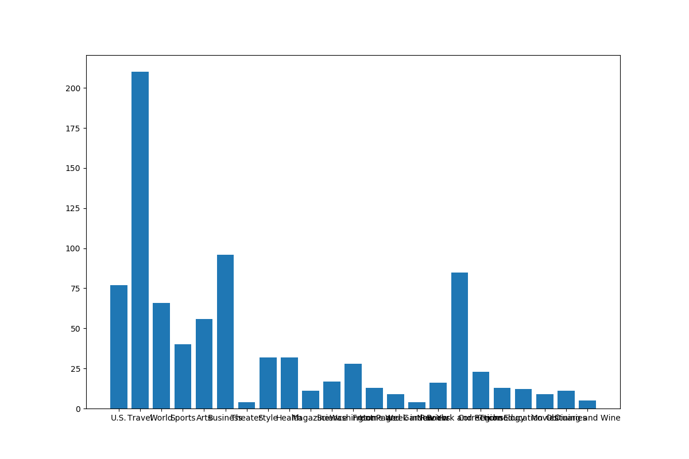

# Data Mining Report 2

计54 马子轩 2015012283

## 数据预处理与可视化

### 数据预处理

搜索xml节点，对内容进行处理，建立表，存入pkl。

其中date为python的datetime类中的date。text为新闻全文。tags是list，其中存放类别。sems为词干化处理后的正文。

```python
import os
from datetime import date
import xml.etree.ElementTree as et
import nltk
import re

import pickle

import nltk.stem

rootPath = "nyt_corpus/samples_500/"

def search(node, attrs):
    if (node.tag == "meta"):
        if (node.attrib["name"] == "publication_day_of_month"):
            attrs["date"] = attrs["date"].replace(day = int(node.attrib["content"]))
        if (node.attrib["name"] == "publication_month"):
            attrs["date"] = attrs["date"].replace(month = int(node.attrib["content"]))
        if (node.attrib["name"] == "publication_year"):
            attrs["date"] = attrs["date"].replace(year = int(node.attrib["content"]))
    
    if (node.tag == "block" and node.attrib["class"] == "full_text"):
        attrs["text"] = ""
        for i in node:
            attrs["text"] = attrs["text"] + " " + i.text
        return

    if (node.tag == "classifier"):
        nodeType = node.text;
        wordList = nodeType.split('/')
        if (len(wordList) > 2 and wordList[0] == "Top" and (wordList[1] == "News" or wordList[1] == "Features")):
            flag = 0
            for i in attrs["tags"]:
                if i == wordList[2]:
                    flag = 1
            if (not flag):
                attrs["tags"].append(wordList[2])
    for i in node:
        search(i, attrs)


if (__name__ == "__main__"):
    fileList = os.listdir(rootPath)
    attrList = []
    for fileName in fileList:
        filePath = os.path.join(rootPath, fileName)
        tree = et.parse(filePath)
        root = tree.getroot()
        attrList.append({})
        attrs = attrList[len(attrList) - 1]
        attrs["date"] = date(2000, 12, 31)
        attrs["text"] = ""
        attrs["tags"] = []
        search(root, attrs)

        tokens = [word for sent in nltk.sent_tokenize(attrs["text"]) for word in nltk.word_tokenize(sent)]
        filteredTokens = []
        for token in tokens:
            if re.search("[a-zA-Z]", token):
                filteredTokens.append(re.sub("[^a-zA-Z]", "", token))

        stemmer = nltk.stem.SnowballStemmer('english')
        stems = [stemmer.stem(t) for t in filteredTokens]
        attrs["stems"] = stems

with open("attr.pkl", "wb") as f:
    pickle.dump(attrList, f)
```

### 数据可视化

#### BagofWord向量

由于是稀疏向量，使用hash建立dict来实现。

```python
import pickle

with open("attr.pkl", "rb") as f:
    attrList = pickle.load(f)

# Bag of words

bow = []

for i in attrList:
    bow.append({})
    for j in i["stems"]:
        if not hash(j) in bow[-1]:
            bow[-1][hash(j)] = 0
        bow[len(bow) - 1][hash(j)] += 1
```

#### 词云图

这一部分由于环境问题，没能最终生成图片，但是做了词频处理和代码编写。只需在配置正确的环境中运行即可。

```python
import pickle
from wordcloud import WordCloud

with open("attr.pkl", "rb") as f:
    attrList = pickle.load(f)

# Wordcloud

wordList = []

for i in attrList:
    for j in i["stems"]:
        wordList.append(j)

text = ' '.join(wordList)

with open("fullText.txt", "w") as f:
    f.write(text)

wc = WordCloud(background_color = 'white', scale = 1.5).generate(text)
wc.to_file('wordcloud.jpg')
```

#### 单词长度直方图

简单统计，并绘图


```python
from matplotlib import pyplot as plt
import pickle

with open("attr.pkl", "rb") as f:
    attrList = pickle.load(f)

# Histogram

# length of word

lenNum = []
for i in range(30):
    lenNum.append(0)

for i in attrList:
    for j in i["stems"]:
        lenNum[len(j)] += 1

plt.figure(0)
plt.figure(figsize = (12, 8))
plt.bar(range(len(lenNum)), lenNum)
plt.savefig("length.png")
plt.close(0)
```

#### 新闻词数直方图


```python
from matplotlib import pyplot as plt
import pickle
import math

with open("attr.pkl", "rb") as f:
    attrList = pickle.load(f)

# Histogram

# binning

wordNum = []

width = 423

widthLabel = []
widthList = []
depthLabel = []
depthList = []

for i in range(10):
    widthLabel.append(str(i * width) + "-" + str((i + 1) * width - 1))
    widthList.append(0)
    depthList.append(50)

for i in attrList:
    length = len(i["stems"])
    wordNum.append(length)
    widthList[math.floor(length / width)] += 1;

wordNum.sort()

for i in range(10):
    depthLabel.append(str(wordNum[i * 50]) + "-" + str(wordNum[(i + 1) * 50 - 1]))

plt.figure(0)
plt.figure(figsize = (12, 8))
plt.bar(widthLabel, widthList)
plt.savefig("widthBin.png")
plt.close(0)

plt.figure(1)
plt.figure(figsize = (12, 8))
plt.bar(depthLabel, depthList)
plt.savefig("depthBin.png")
plt.close(1)
```

#### 类别直方图



```python
from matplotlib import pyplot as plt
import pickle
import math

with open("attr.pkl", "rb") as f:
    attrList = pickle.load(f)

# Histogram

# tags

tagMap = {}
tagList = []
tagNum = []

for i in attrList:
    tags = i["tags"]
    for j in tags:
        if not j in tagMap:
            tagMap[j] = len(tagList)
            tagList.append(j)
            tagNum.append(0)
        tagNum[tagMap[j]] += 1

plt.figure(0)
plt.figure(figsize = (12, 8))
plt.bar(tagList, tagNum)
plt.savefig("tags.png")
plt.close(0)
```

#### 月份直方图


```python
from matplotlib import pyplot as plt
import pickle
import math

with open("attr.pkl", "rb") as f:
    attrList = pickle.load(f)

# Histogram

# date

dateMap = {}
dateList = []
dateNum = []

for i in attrList:
    date = i["date"]
    strDate = date.strftime("%Y-%m")
    if not strDate in dateMap:
        dateMap[strDate] = len(dateList)
        dateList.append(strDate)
        dateNum.append(0)
    dateNum[dateMap[strDate]] += 1

plt.figure(0)
plt.figure(figsize = (12, 8))
plt.bar(dateList, dateNum)
plt.savefig("date.png")
plt.close(0)
```

## 高维向量可视化

采用sklearn库中pca和tsne算法进行降维


```python
import numpy as np
from sklearn.decomposition import PCA
from sklearn.manifold import TSNE
from matplotlib import pyplot as plt

with open("100_word_vector.txt", "r") as f:
    content = f.read()

cList = content.split()

wordList = []
vectorList = []

idx = 0
for i in range(100):
    wordList = cList[idx]
    idx += 1
    vectorList.append([])
    for j in range(100):
        vectorList[i].append(cList[idx])
        idx += 1

vec = np.array(vectorList)

pcaList = PCA(n_components = 2).fit_transform(vec)
tsneList = TSNE(n_components = 2).fit_transform(vec)

pcax = pcaList[:, 0]
pcay = pcaList[:, 1]

plt.figure(0)
plt.figure(figsize = (12, 8))
plt.scatter(pcax, pcay)
plt.savefig("pca.png")
plt.close(0)

tsnex = tsneList[:, 0]
tsney = tsneList[:, 1]

plt.figure(1)
plt.figure(figsize = (12, 8))
plt.scatter(tsnex, tsney)
plt.savefig("tsne.png")
plt.close(1)
```

这种情况可看出，两种方式生成的二位散点图分布较为类似。

## 实验总结

在这个实验中，我一开始使用了R语言，但是R语言的学习成本较高。关键对于我们来说，他的组织方式比较奇怪，不太像传统的编程语言。所以我在学习一段时间之后选择换回python。因此耽误了一些时间。
